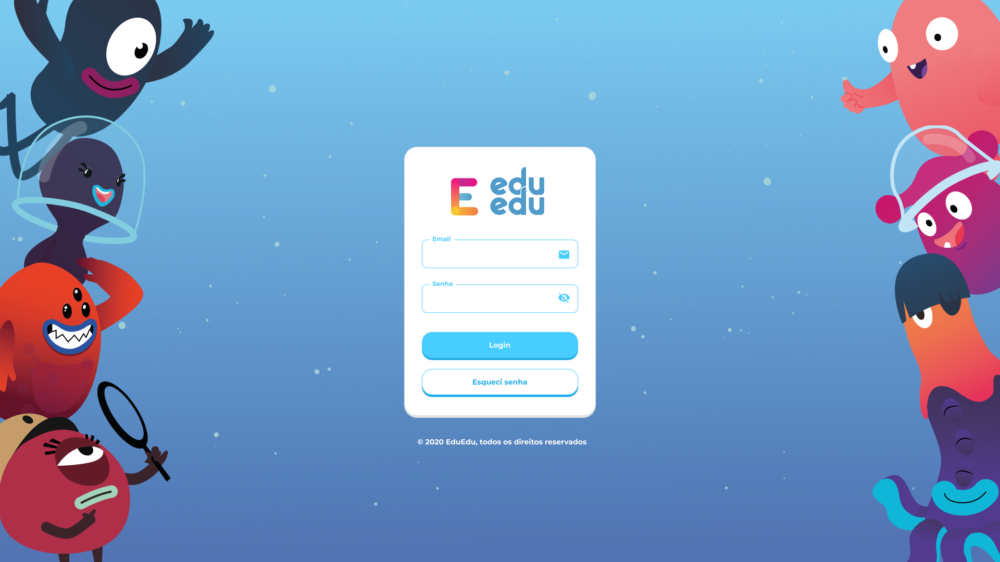
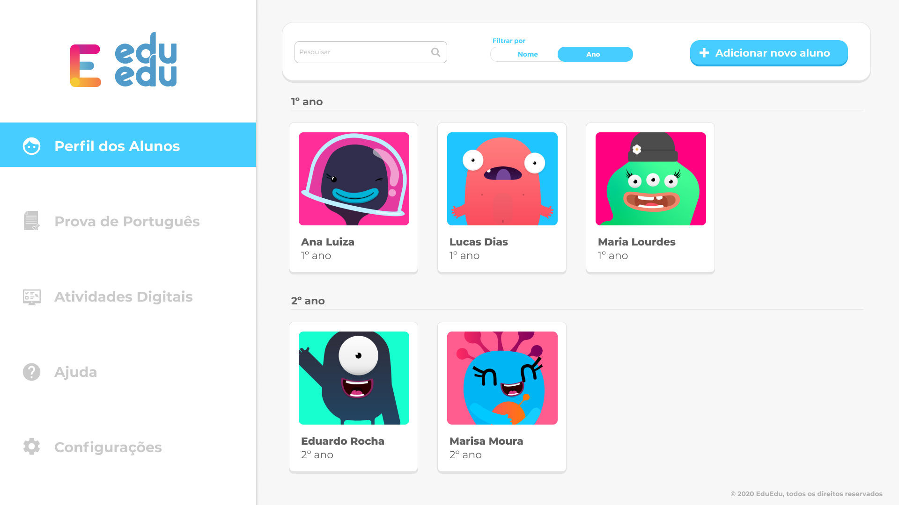
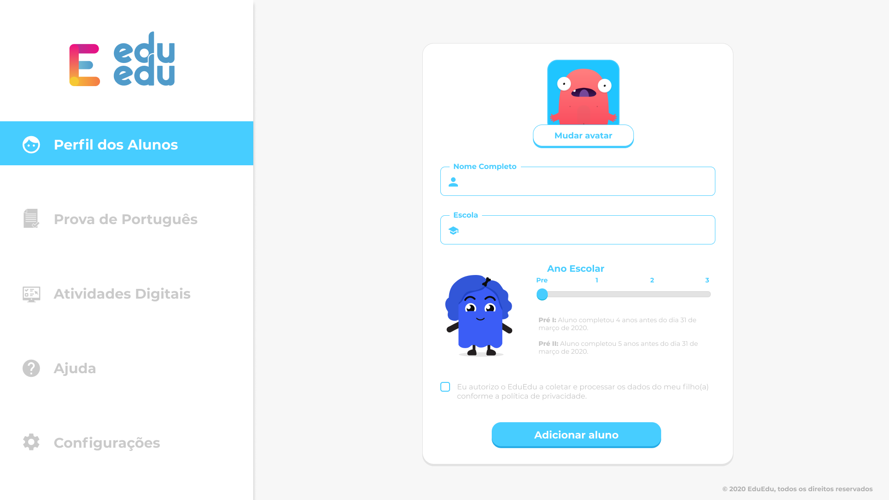

    

# Bem vind@ ao Instituto ABCD!

Olá! Somos uma organização social que se **dedica a melhorar a qualidade de vida** de pessoas com **dislexia** e **dificuldades de aprendizagem**.

Se você chegou até o desafio técnico, meus parabéns! Siga as instruções abaixo e ao final do teste retorne o email com o **link da sua aplicação no ar**, e o  **link do seu repositório** ou faça um **PR** para este, boa sorte e até a próxima etapa! 

# Sobre o desafio

Este é um teste básico, onde você deve ser capaz de escrever uma aplicação web, usando as telas fornecidas como referência. 

Estamos buscando por um projeto bem organizado e testado.

## Tarefa

Usando as telas ([FIGMA](https://www.figma.com/file/E6xnTQbUwhvCZ50hMsIWEj/EduEdu---Teste)) fornecidas como referência, você irá precisar construir a aplicação e os componentes necessários utilizando React ou VueJS. 

Não esqueça de incluir um README com instruções de *setup*, e qualquer teste ou outra documentação que você criou como parte da sua solução.

Você pode usar frameworks ou pacotes que desejar, uma vez que consiga nos explicar a motivação de as ter escolhido.

 

## Design

  
  
   
 

 

As telas acima você encontra no [FIGMA](https://www.figma.com/file/E6xnTQbUwhvCZ50hMsIWEj/EduEdu---Teste). As métricas de design devem ser seguidas. 

Os assets você encontra na pasta [assets](./assets) ou pode extrair, direto do Figma.

Não existe tela desenhada para versão mobile, mas se você construir um app responsivo, **será um grande plus**.

Encorajamos que você use as técnicas mais novas de CSS (Como flex-box) e abordagens de design responsivo.

 

## Detalhes

#### 1. Autenticação

 - [ ] O login deve ser feito utilizando Firebase Auth.
 - [ ] Apenas usuários autenticados podem acessar as outras páginas do sistema.

#### 2. Listagem de Crianças

 - [ ] A listagem de crianças consulta uma coleção no Firebase Firestore.
 - [ ] Ordenar pelo ano escolar.
 - [ ] Os cards devem conter: **Imagem, Nome da criança e Ano escolar**.
 - [ ] Os assets de avatars são carregados do FireStorage.

 Para a funcionalidade de busca:
- [ ] Deve filtrar os alunos previamente cadastrados.
- [ ] Deve iniciar a filtragem após digitar 3 caracteres.

#### 3. Cadastro de criança
- [ ] Deve permitir alterar o avatar da criança.
- [ ] Todos os campos devem estar preenchidos e o checkbox de aceite de termos ativado para que o usuário consiga cadastrar uma criança.
- [ ] Ao cadastrar é exibida a listagem de crianças atualizada.

Atentar para criação de componentes para cada parte da página (exp: menu lateral, footer, header, etc).
Você pode assumir que não precisa lidar com suporte a browsers legados que não possuam funcionalidades como flexbox.

 
 

## Interessante possuir

Estes não são obrigatórios, mas será um grande plus se você implementar. Aqui estão algumas sugestões que gostaríamos de ver::

- Implementar a solução usando TypeScript.

- Implementar a solução usando VueJS ou React.

- Responsivo para mobile device.

- Mostrar seu progresso pelo bom uso do git commit history.

- Código preparado para produção (clean, maintainable, reusable code)

- Implementação de testes unitários.
 

## Submissão

* Por favor, submeta seu código enviando o link do repositório por email.
* Não esqueça de incluir um README com instruções de *setup*, e qualquer teste ou outra documentação que você criou como parte da sua solução.
 

## Tabela de Pontos do Projecto

Iremos quantificar o projeto de acordo com as tabelas abaixo.

Antes de tudo, os projetos dos candidatos devem ter todos os requerimentos da tabela base.
 

| Requerimentos base| Pontos |          
| --- | --- |
| Funcionalidades | 10 Pontos por tela completa |
| (React ou VueJS) & State Management | 20 Pontos |
| Em produção & Boas práticas | 15 Pontos |
| Estruturação de pastas e arquivos do projeto | 5 Pontos |
 

Você ganhará pontos extra se implementar funcionalidades extras.
 

| Bonus   | Pontos |          
| --- | --- |
| Cada funcionalidade extra | 5 Pontos |
| Utilizar o lottie na seleção do ano escolar | 5 Pontos |
| Git commit history| 10 Pontos |
| Unit Tests por tela | 20 Pontos |
